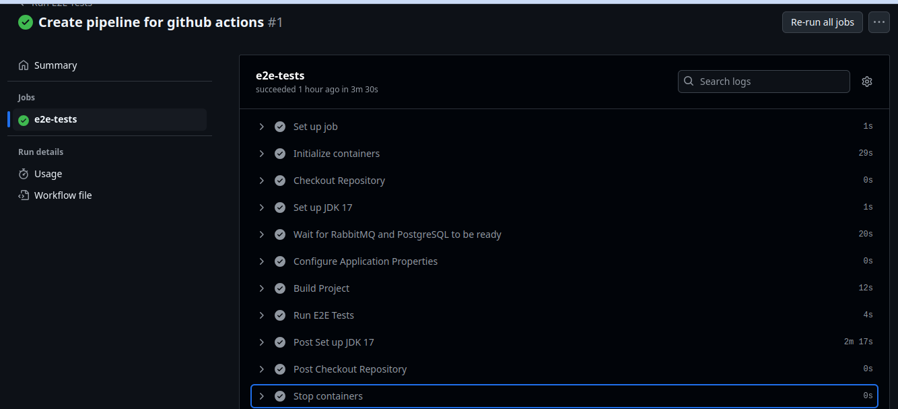

# GitHub Actions: e2e-tests.yml Documentation

## Overview
This document explains the functionality of the `e2e-tests.yml` GitHub Actions workflow. It describes its execution process, the automatic services it uploads, and how to review the test results in GitHub.


## Workflow Breakdown
The `e2e-tests.yml` file is a GitHub Actions workflow that runs end-to-end (E2E) 
tests automatically in a CI/CD pipeline. Below is a breakdown of its main components:

### 1. **Trigger**
The workflow is triggered by specific GitHub events:
```yaml
on:
  push:
    branches:
      - main
      - develop
  pull_request:
    branches:
      - main
      - develop
  workflow_dispatch:
```
This means the workflow runs when code is pushed or a pull request is made to the `main` or `develop` branch.

### 2. **Jobs and Steps**
#### **Job: `e2e-tests`**
- **Runs on**: `ubuntu-latest`
- **Steps**:

    - **Checkout Code**:
      ```yaml
      - name: Checkout repository
        uses: actions/checkout@v4
      ```
      This step clones the repository into the GitHub-hosted runner.

    - **Set Up Node.js**:
      ```yaml
      - name: Set up JDK 17
        uses: actions/setup-java@v3
        with:
          distribution: 'temurin'
          java-version: '17'
          cache: maven
      ```
      This ensures the correct java version is available for running tests.

    - **Wait for RabbitMQ and PostgreSQL**:
      ```yaml
      - name: Wait for RabbitMQ and PostgreSQL to be ready
        run: |
          echo "Waiting for services to be ready..."
          sleep 20
      ```
      This step wait for needed external tools for the tests.

  - **Configure Application Properties**:

    Set the configuration required in `application-test.properties`

  - **Build Project**:
    ```yaml
    - name: Build Project
      run: mvn clean package -DskipTests
    ```
    Create the target with all maven configuration and jar file

    - **Run E2E Tests**:
    ```yaml
    - name: Run E2E Tests
      run: mvn test -Dspring.profiles.active=test
    ```
    Executes the E2E test suite maven.

    - **Upload Test Artifacts**:
    ```yaml
    - name: Upload test results
      uses: actions/upload-artifact@v4
      with:
        name: e2e-test-results
        path: target/cucumber-reports
    ```
    This step uploads test results as artifacts, making them available for review.

## Services Automatically Uploaded
The workflow includes the `upload-artifact` action, which automatically uploads the test results to GitHub. The uploaded artifacts are stored in GitHub and can be downloaded later for review.

## Reviewing Test Results
### 1. **On GitHub**
To review test results:
1. Go to the **Actions** tab in your repository.
2. Select the latest workflow run.
3. Click on **Artifacts** to download the `e2e-test-results`.
4. Check the test logs in the **Run end-to-end tests** step for failures.

## Conclusion
This workflow automates E2E tests, ensuring that code changes are validated before merging into `main`. The results are stored as artifacts for review in GitHub
